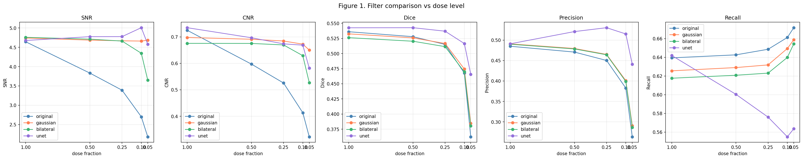

# Low-Dose X-ray Angiography: Task-Based Evaluation of Denoising for Vessel Segmentation


## 1 Overview

Reducing radiation dose in X-ray angiography increases quantum noise and degrades image quality. However, improved visual appearance does not necessarily translate to better clinical utility.

This project evaluates classical filters and a self-supervised deep learning denoiser (Noise2Void) under low-dose conditions, with a focus on **task-based evaluation**:

> Do denoising methods actually improve vessel segmentation performance?

Rather than relying on perceptual quality alone, this study benchmarks denoising approaches based on their impact on a downstream vessel segmentation pipeline.
---

## 2 Key Questions

* How does low-dose (Poisson) noise affect vessel visibility in angiography images?
* Do classical filters improve or degrade segmentation performance?
* Can a self-supervised CNN denoiser (Noise2Void) better preserve vessel structures?
* Is improved image quality correlated with better segmentation?

---

## 3 Dataset

* **ARCADE coronary angiography dataset** (syntax task only)
* 1000 training images (used for self-supervised denoising, no masks needed)
* 200 validation images with vessel annotations (used for benchmarking)
**Note:** Ground truth annotations follow the SYNTAX protocol and include only major coronary vessels. Small or low-contrast vessels may be present in the image but not labeled, which affects precision/recall interpretation.

**Data format:**

* Grayscale PNG images, normalized to [0, 1], vessels appear dark on bright background
* Vessel annotations provided as COCO polygons → rasterized to binary masks (uint8, vessel=1, background=0)

---

## 4 Project Structure

```
.
├── data/                          # Dataset (unpacked from arcade.zip, git-ignored)
│   └── syntax/
│       ├── train/                 # 1000 images for N2V training
│       │   ├── images/
│       │   └── annotations/train.json
│       └── val/                   # 200 images with masks for benchmarking
│           ├── images/
│           └── annotations/val.json
├── datasets/
│   ├── arcade_dataset.py          # ArcadeDataset class (loads images + masks)
│   └── n2v_dataset.py             # Noise2Void dataset (handles loading, dose reduction, patching and masking + validation dataset)
├── algorithms/                    # One file per filter 
│   ├── gaussian.py
│   ├── bilateral.py
│   ├── frangi.py
│   └── n2v.py
├── metrics/                       # One file per metric group
│   ├── snr_cnr.py             # SNR, CNR
│   └── dice.py           # Frangi + Dice for task-based evaluation
│   
├── training/
│   ├── unet.py             # Unet architecture
│   ├── n2v_masking.py             # routines for patches and masking for noise2void training
│   ├── predict.py             # routine for n2v filter prediction output
│   └── train_n2v.py               # N2V training loop and logging
├── notebooks/
│   ├── 01_data_exploration.ipynb  # Explore val dataset, compute baselines
│   ├── 02_low_dose.ipynb # Apply dose reduction, compute baseline metrics
│   ├── 03_n2v_unet.ipynb # Train Noise2Void U-Net denoiser
│   └── 04_filter_comparison.ipynb  # Apply filters to denoise, generate evaluation plots
├── figures/                       # Figures to include to ReadMe
├── results/                       # Generated outputs (git-ignored)
│   ├── noisy_metrics_baseline.csv # metrics baseline 
│   ├── traaining_log.csv          # Unet training log
│   └── metrics_table.csv          # Benchmark results
├── scripts/
│   └── generate_noisy_dataset.py  # apply dose reduction to validation dataset and save images for reproducable results
├── .gitignore                     # Excludes data/, results/, etc.
├── .env                           # Local paths (ARCADE_ROOT=data/)
└── README.md                      # This file
```

## 5 Methods

### 5.1 Low-dose simulation

To simulate reduced radiation dose, Poisson noise is applied to the images:

* Intensity scaling → Poisson sampling → rescaling
* Noise levels: **50%, 25%, 10%, 5% dose**

This approximates photon-counting statistics in X-ray imaging.

---

### 5.2 Denoising methods

We compare representative approaches from different paradigms:

**Classical filters**

* Gaussian filter (baseline smoothing)
* Bilateral filter (edge-preserving)

**Learning-based**

* Noise2Void (self-supervised U-Net, PyTorch)


These methods span different levels of prior knowledge: from purely local filtering to learned data-driven denoising.
---

### 5.3 Segmentation pipeline

A simple, fixed downstream task is used:

* Frangi vesselness filter
* Thresholding
* Binary vessel mask

This allows controlled evaluation of how preprocessing affects segmentation.

---

## 6 Evaluation

### 6.1 Image quality metrics

* SNR (Signal-to-Noise Ratio)
* CNR (Contrast-to-Noise Ratio)

### 6.2 Task-based metrics

* Precision, recall, Dice coefficient. Dice is used as the primary metric, with precision and recall providing insight into false positive vs false negative behavior.

### 6.3 Efficiency

* Execution time per method

Results are saved to `results/metrics_table.csv` for analysis.


## 7 Experimental Setup

For each noise level (50%, 25%, 10%, 5%):

1. Apply noise to clean images
2. Apply each denoising method
3. Run segmentation pipeline
4. Compute metrics

---

## 8 Results

### 8.1 Quantitative results

Below we present a metric dependence on dose reduction for different denoising algorithms.


*Figure 1. Filter comparison vs dose level.*

### 8.2 Execution time

Average per-image inference time (CPU, 512×512):

| Method    | Avg time (s) |
| --------- | ------------ |
| Original  | < 0.001      |
| Gaussian  | 0.005        |
| Bilateral | 0.014        |
| U-Net     | 0.533        |

### 8.3 Visual comparison

A representative sample (median Dice improvement at 10% dose) is selected to illustrate typical behavior. The figure shows:

* Original image
* Noisy image with ground truth
* Gaussian, Bilateral, and Noise2Void outputs with segmentation overlays

This example highlights how denoising affects both noise suppression and vessel detection.


*Figure 2. Median sample: dose reduction and denoising.*

---

### 8.4 Key Findings

* Image quality (SNR, CNR) degrades significantly with decreasing dose, as expected.

* Gaussian filtering provides a strong classical baseline, outperforming bilateral filtering in high-noise regimes. This suggests that edge-preserving filters are less effective when intensity gradients are dominated by noise.

* The Noise2Void U-Net consistently achieves the best overall performance, particularly at low dose levels.

* At moderate noise levels (50%–25%), Dice scores slightly increase for the U-Net. This is attributed to suppression of small vessel-like structures that are detected by Frangi but not included in ground truth annotations.

* Precision–recall analysis reveals that the U-Net shifts segmentation toward higher precision and lower recall, indicating more conservative predictions with fewer false positives but reduced sensitivity to weak vessels.

* At very low dose (≤10%), all methods degrade, suggesting that structural information is fundamentally lost rather than merely corrupted by noise.

---

## 9 Discussion

### 9.1 Image quality vs task performance

Improved perceptual quality does not always translate to better segmentation performance. Task-based metrics are essential for evaluating clinical relevance.

### 9.2 Failure cases

* Small vessels are often lost after aggressive smoothing
* Frangi filter sensitivity decreases with reduced contrast
* Learning-based methods may introduce artifacts under extreme noise

### 9.3 Annotation bias and metric interpretation

Because ground truth annotations do not include all visible vessel structures, particularly fine vessels, some correct detections are treated as false positives. As a result, precision may be underestimated and recall overestimated. This bias must be considered when interpreting segmentation performance.
---

## 10 Conclusion

This study demonstrates that denoising must be evaluated in the context of downstream tasks, not only visual quality.

Classical filters provide limited robustness under strong noise conditions, while self-supervised deep learning offers a more effective trade-off between noise suppression and structure preservation.

Importantly, improvements in segmentation metrics may reflect alignment with annotation bias rather than true recovery of all vessel structures, highlighting the need for careful interpretation of task-based evaluation.

---

## 11 Tech Stack

* Python
* PyTorch
* OpenCV
* scikit-image
* piq

---


## 12 Author

Dr. Anna Lyamkina
Physicist | Medical Imaging | Machine Learning
